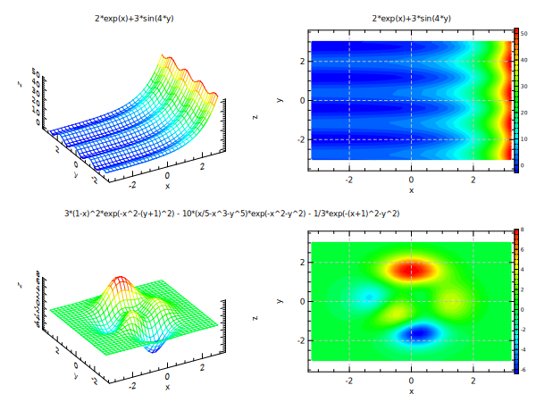

# ex13b: Plot 3D meshed surface by some functions (part.2)
```
opt (ts:0.9 gd:1 al:50 az:30)

set x = range(32,-3.2,3.2)
set y = range(30,-3,3)

@ expr3 = "2*exp(x)+3*sin(4*y)"
@ expr4 = "3*(1-x)^2*exp(-x^2-(y+1)^2) - 10*(x/5-x^3-y^5)*exp(-x^2-y^2) - 1/3*exp(-(x+1)^2-y^2)"

div 2 2
do n 3 4
  mset z = [expr[n]]
  mplot x y z (tl:"[expr[n]]" mt:mesh2)
  mplot x y z (tl:"[expr[n]]" mt:cont2)
end

div 1 16                      ;# divide very narrow area
box 0 1 0 1 (lw:0 bp:9)       ;# make null box at center position (bp:9)
text 0 0.5 "[expr4]" (ts:2.45) ;# draw long text for the title of expr4
```

