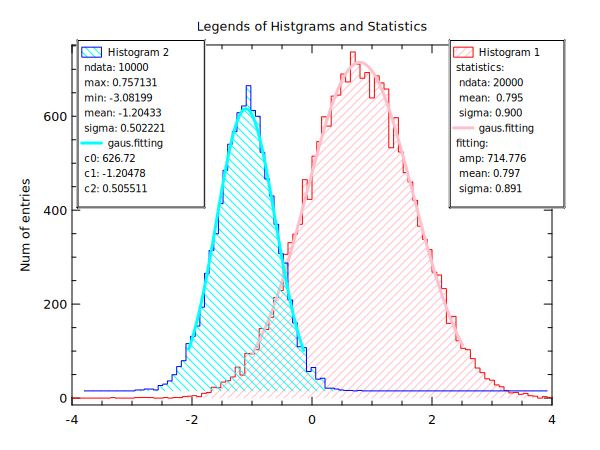

# ex28: Draw legends of Histgrams and Statistics
```
title "Legends of Histgrams and Statistics"

set x1=random(20000,gaus,0.9,0.8)
set x2=random(10000,gaus,0.5,-1.2)

xlab " "
ylab "Num of entries"
opt (ym:0.02 xr:-4,4 ts:0.9)

# Here we get statistics from 'stat' command 
hplot x1 (lc:red fc:pink ft:p45 lg:"Histogram 1")
stat x1
leg add "statistics:"
leg add " ndata: [%.0f:x1_ndata]"
leg add " mean:  [%.3f:x1_mean]"
leg add " sigma: [%.3f:x1_sigma]"

# Here we get fitting coefficinets from 'cf:' option 
hfit x1 gaus (lc:pink lw:3 lg:"gaus.fitting" cf:c)
leg add "fitting:"
leg add " amp: [%.3f:c0]"
leg add " mean: [%.3f:c1]"
leg add " sigma: [%.3f:c2]"
leg show

# Here we use special tag %stat and %fit
hplot x2 (lc:blue fc:cyan ft:n45 lg:"Histogram 2 %stat" rp:1)
hfit x2 gaus (lc:cyan lw:3 lg:"gaus.fitting %fit")
leg show l,t
```

