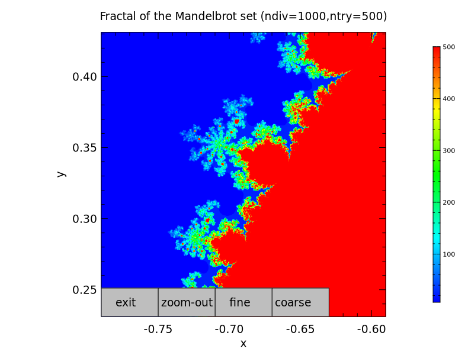

# ex34: Demonstration to obtain the positon at the mouse cursor
```
#
# using Mandelbrot plotting macro: doc/macro/ex27.tip
#
args ndiv=100,ntry=50

fmt %.15g
# Initial range to show Mandelbrot plot
@ x0 = -2
@ x1 = 0.5
@ y0 = -1.3
@ y1 = 1.3

@ zwsize = 0.1 ;# zoom window size

@ inhibit = 0  ;# flag to inhibit plotting

while 1
  prn zoom-window-size = [zwsize]

# draw Mandelbrot
  if ![inhibit]
    exe doc/macro/ex27.tip ndiv=[ndiv],ntry=[ntry],xr="[x0]:[x1]",yr="[y0]:[y1]"
  fi
# calc graph-span of x and y
  @ dx = [x1-x0]
  @ dy = [y1-y0]

# draw "exit button"
  @ x2 = [x0+0.2*dx]
  @ y2 = [y0+0.1*dy]
  fbox [x0] [x2] [y0] [y2] (fc:gray ft:solid)
  text [x0+dx*0.05] [y0+dy*0.05] "exit"

# draw "zoom-out" button
  @ x3 = [x2+0.2*dx]
  fbox [x2] [x3] [y0] [y2] (fc:gray ft:solid)
  text [x2+dx*0.01] [y0+dy*0.05] "zoom-out"

# draw "fine" button
  @ x4 = [x3+0.2*dx]
  fbox [x3] [x4] [y0] [y2] (fc:gray ft:solid)
  text [x3+dx*0.05] [y0+dy*0.05] "fine"

# draw "coarse" button
  @ x5 = [x4+0.2*dx]
  fbox [x4] [x5] [y0] [y2] (fc:gray ft:solid)
  text [x4+dx*0.01] [y0+dy*0.05] "coarse"

  getpos x y ;# get x,y position at the mouse cursor

  if [x0]<[x]<[x2] & [y0]<[y]<[y2]   ;# area of "exit button"
    break
  elif [x2]<[x]<[x3] & [y0]<[y]<[y2] ;# area of "zoom-out button"
    if [zwsize] < 10
      @ zwsize *= 10
      @ x0 = [x0+dx/2-zwsize]
      @ x1 = [x1-dx/2+zwsize]
      @ y0 = [y0+dy/2-zwsize]
      @ y1 = [y1-dy/2+zwsize]
      @ inhibit = 0
    else
      prn !! Cannot zoom-out any further (zwsize=[zwsize])
      @ inhibit = 1
    fi
  elif [x3]<[x]<[x4] & [y0]<[y]<[y2] ;# area of "fine button"
     @ ndiv = 1000
     @ ntry = 500
  elif [x4]<[x]<[x5] & [y0]<[y]<[y2] ;# area of "coarse button"
     @ ndiv = 100
     @ ntry = 50
  else
    if [zwsize] > 1e-6
      @ x0 = [x-zwsize]
      @ x1 = [x+zwsize]
      @ y0 = [y-zwsize]
      @ y1 = [y+zwsize]
      fbox [x0] [x1] [y0] [y1] (lc:pink lw:2)
      @ zwsize *= 0.1
      @ inhibit = 0
    else
      prn !! Cannot zoom-in any further (zwsize=[zwsize])
      @ inhibit = 1
    fi
  fi
end

```

