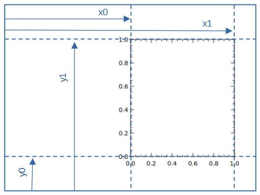
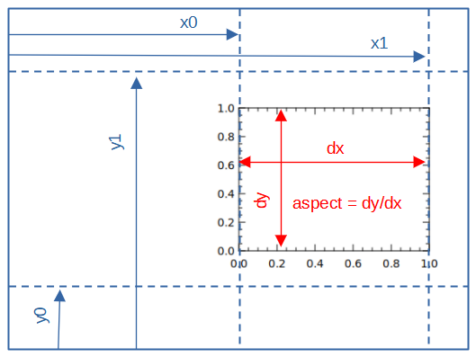

# viewport, vp
```
tip> vp
Usage: vp x0 x1 y0 y1 aspect
       vp show | reset
Set viewport range.
  x0,x1 : x‑range [0–1]
  y0,y1 : y‑range [0–1]
  aspect: y‑width / x‑width
```

|argument|description |value|
|:---:|:---:|:---:|
|x0 | ratio of beginning of x-axis| 0 to 1 |
|x1 | ratio of ending of x-axis| 0 to 1 |
|y0 | ratio of beginning of y-axis| 0 to 1 |
|y1 | ratio of ending of y-axis| 0 to 1 |
|aspect| ratio of dy/dx| 0 to 1 |

> if x1=0 or y1=0, viewport is calculated automatically.  
> If the aspect ratio is not 0, the x0, x1, y0, y1 values ​​will be adjusted to maximize the viewport.

## special argument

- `vp reset` : set default value : `vp 0 0 0 0 0`
- `vp show` : show current viewport values

## example 1 (aspect ratio is 0)

- x0 = 0.5
- x1 = 0.9
- y0 = 0.2
- y1 = 0.8 
- aspect 0

`vp 0.5 0.9 0.1 0.8  0;  box 0 1 0 1`



## example 2 (aspect ratio is not 0)

- x0 = 0.5
- x1 = 0.9
- y0 = 0.2
- y1 = 0.8 
- aspect 0.75

`vp 0.5 0.9 0.1 0.8  0.75;  box 0 1 0 1`


